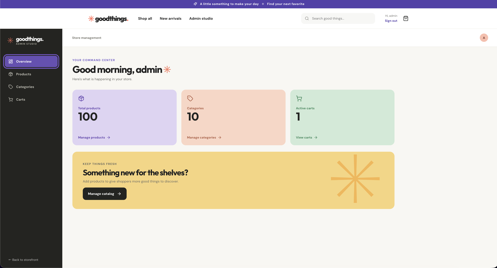
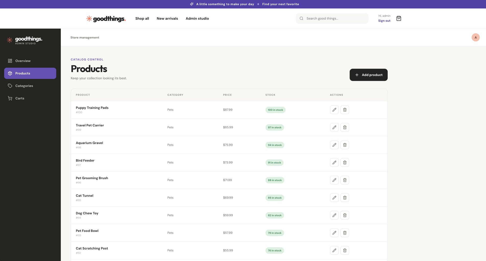

# ecom-app

Polyglot monorepo for two compatible ecommerce backend implementations, a React storefront, and shared development utilities.

## Screenshots

### Home


### Catalog


### Admin dashboard



### Admin products



## Repository layout

```text
ecom-app/
|-- apps/
|   `-- web/                 # React storefront and admin studio
|-- services/
|   |-- api-spring/          # Java 21, Spring Boot 4, Gradle
|   `-- api-fastapi/         # Python 3.12, FastAPI, uv
|-- contracts/
|   `-- openapi/             # Canonical shared OpenAPI contract
`-- tools/
    `-- bruno-api/           # Bruno API collection
```

The backend projects retain their native build tools and can be developed independently. Their original `main` histories were imported without squashing.

## Root development commands

Run one backend implementation at a time:

```bash
make dev-spring    # http://localhost:8080/api
make dev-fastapi   # http://localhost:8000/api
make seed-spring   # Load sample catalog into Spring Boot database
make seed-fastapi  # Load sample catalog into FastAPI database
make web           # http://localhost:5173
make help          # list root commands
```

The two API server commands run in the foreground and can be stopped with Ctrl-C. Each backend manages its own database setup as described in its service README.

Install frontend dependencies with `npm --prefix apps/web install`. To see the sample Spring catalog, run `make seed-spring` once, then keep `make dev-spring` running in one terminal while you run `make web` in another. The seed command exits after filling MySQL; it does not serve the API. Check `http://localhost:8080/api/public/products` if the storefront appears empty. The development proxy targets Spring Boot by default. To use FastAPI, run `API_PROXY_TARGET=http://localhost:8000 make web`. See [the web README](apps/web/README.md) for routes, checks, and deployment configuration.

## Backend commands

Commands can also be run directly from the service directories.

### Spring Boot

```bash
cd services/api-spring
make setup
make run
make test
make code-format
```

See [the Spring API README](services/api-spring/README.md) for configuration details.

### FastAPI

```bash
cd services/api-fastapi
make setup
make migrate
make run
uv run pytest -v
make code-format
```

See [the FastAPI README](services/api-fastapi/README.md) for configuration details.

## Shared API behavior

Both implementations expose routes below `/api`. The canonical shared paths,
payloads, pagination, authentication, and authorization behavior are defined in
[`contracts/openapi/openapi.yaml`](contracts/openapi/openapi.yaml).

Local authentication uses the `ecommerce-app` HTTP-only JWT cookie. Development seed accounts are `user/userpass`, `seller/sellerpass`, `seller2/seller2pass`, `seller3/seller3pass`, and `admin/adminpass`. Each API's seed command loads the same 10 categories and 100 products from `tools/seed/catalog.json` into its own development database.

## Bruno collection

Open `tools/bruno-api` in [Bruno](https://www.usebruno.com/). Requests use the `api_url` environment variable rather than a hard-coded host:

| Backend | `api_url` |
| --- | --- |
| Spring Boot | `http://localhost:8080/api` |
| FastAPI | `http://localhost:8000/api` |
